# Entity-Relationship Diagram (ERD)
## Flood Monitoring System with GIS Database Schema

This document provides a comprehensive Entity-Relationship Diagram (ERD) for the Flood Monitoring System with GIS, showing all database entities, their attributes, and relationships across the three Django apps: Users, Maps, and Monitoring.

---

## Database Schema Overview

The system consists of **13 core entities** organized into three functional domains:

- **Users Domain** (3 entities): User management, authentication, and security
- **Maps Domain** (6 entities): GIS data, flood susceptibility, and activity tracking
- **Monitoring Domain** (4 entities): Weather monitoring, flood records, and risk thresholds

---

## ERD Diagram

```mermaid
erDiagram
    %% ============================================
    %% USERS APP - Authentication & User Management
    %% ============================================
    
    CustomUser {
        int id PK
        string username UK
        string password
        string email
        string first_name
        string last_name
        string staff_id UK "Auto-generated YEAR+4digits"
        boolean is_approved "Admin approval status"
        string position "DRRMO position/role"
        string custom_position "Custom position if Others"
        string contact_number "11 digits Philippine format"
        string emergency_contact
        string emergency_number
        string profile_image "Upload path"
        text bio "Max 500 chars"
        date date_of_birth "Age 18-80 validation"
        boolean is_staff
        boolean is_superuser
        boolean is_active
        datetime date_joined
        datetime last_login
    }
    
    UserLog {
        int id PK
        int user_id FK
        string action "User action description"
        datetime timestamp "Auto-generated"
        boolean is_archived "Archiving status"
        datetime archived_at "When archived"
    }
    
    LoginAttempt {
        int id PK
        string username "Username attempted"
        string ip_address "IP address of attempt"
        datetime timestamp "Auto-generated"
        boolean success "Login success status"
    }
    
    %% ============================================
    %% MAPS APP - GIS Data & Activity Tracking
    %% ============================================
    
    Barangay {
        string id PK "9-char PSGC code"
        string name "Barangay name"
        string parent_id "8-char parent PSGC"
        MultiPolygon geometry "PostGIS boundary"
    }
    
    FloodSusceptibility {
        int id PK
        string lgu "Silay City"
        string psgc_lgu "64526000"
        string haz_class "Flooding"
        string haz_code "VHF/HF/MF/LF"
        string haz_desc "Auto-generated from code"
        decimal haz_area_ha "Hazard area in hectares"
        MultiPolygon geometry "PostGIS boundary"
    }
    
    AssessmentRecord {
        int id PK
        int user_id FK
        string barangay "Barangay name"
        decimal latitude "10,6 precision"
        decimal longitude "10,6 precision"
        string flood_risk_code "VHF/HF/MF/LF"
        string flood_risk_description
        datetime timestamp "Auto-generated"
        boolean is_archived "Archiving status"
        datetime archived_at "When archived"
    }
    
    ReportRecord {
        int id PK
        int user_id FK
        int assessment_id FK "Optional link"
        string barangay "Barangay name"
        decimal latitude "10,6 precision"
        decimal longitude "10,6 precision"
        string flood_risk_code "VHF/HF/MF/LF"
        string flood_risk_label
        datetime timestamp "Auto-generated"
        boolean is_archived "Archiving status"
        datetime archived_at "When archived"
    }
    
    CertificateRecord {
        int id PK
        int user_id FK
        int assessment_id FK "Optional link"
        string establishment_name "Max 200 chars"
        string owner_name "Max 200 chars"
        text location "Full address"
        string barangay "Barangay name"
        decimal latitude "10,6 precision"
        decimal longitude "10,6 precision"
        string flood_susceptibility "Risk level"
        string zone_status "Safety zone status"
        string issue_date "Formatted date string"
        datetime timestamp "Auto-generated"
        boolean is_archived "Archiving status"
        datetime archived_at "When archived"
    }
    
    FloodRecordActivity {
        int id PK
        int user_id FK
        string action "CREATE/UPDATE/DELETE"
        int flood_record_id "Reference to FloodRecord"
        string event_type "Max 200 chars"
        datetime event_date "Event occurrence date"
        string affected_barangays "Max 500 chars"
        int casualties_dead
        int casualties_injured
        int casualties_missing
        int affected_persons
        int affected_families
        float damage_total_php "Total damage in PHP"
        datetime timestamp "Auto-generated"
        boolean is_archived "Archiving status"
        datetime archived_at "When archived"
    }
    
    %% ============================================
    %% MONITORING APP - Weather & Flood Data
    %% ============================================
    
    RainfallData {
        int id PK
        float value_mm "Rainfall in millimeters"
        datetime timestamp "Auto-generated"
        string station_name "Silay City default"
    }
    
    TideLevelData {
        int id PK
        float height_m "Tide height in meters"
        datetime timestamp "Auto-generated"
        string station_name "Silay City default"
    }
    
    WeatherData {
        int id PK
        float temperature_c "Temperature in Celsius"
        int humidity_percent "Humidity percentage"
        float wind_speed_kph "Wind speed in km/h"
        datetime timestamp "Auto-generated"
        string station_name "Silay City default"
    }
    
    FloodRecord {
        int id PK
        string event "Event name/description"
        date date "Event date"
        string affected_barangays "Max 500 chars"
        int casualties_dead
        int casualties_injured
        int casualties_missing
        int affected_persons
        int affected_families
        int houses_damaged_partially
        int houses_damaged_totally
        float damage_infrastructure_php
        float damage_agriculture_php
        float damage_institutions_php
        float damage_private_commercial_php
        float damage_total_php "Sum of all damages"
    }
    
    BenchmarkSettings {
        int id PK "Singleton: Always id=1"
        float rainfall_moderate_threshold "Default: 30mm"
        float tide_moderate_threshold "Default: 1.0m"
        float rainfall_high_threshold "Default: 50mm"
        float tide_high_threshold "Default: 1.5m"
        string combined_risk_method "max/rainfall_priority/tide_priority/equal"
        datetime created_at "Auto-generated"
        datetime updated_at "Auto-updated"
        string updated_by "Username of last updater"
    }
    
    %% ============================================
    %% RELATIONSHIPS
    %% ============================================
    
    %% User Relationships (One-to-Many)
    CustomUser ||--o{ UserLog : "generates"
    CustomUser ||--o{ AssessmentRecord : "creates"
    CustomUser ||--o{ ReportRecord : "generates"
    CustomUser ||--o{ CertificateRecord : "issues"
    CustomUser ||--o{ FloodRecordActivity : "performs"
    
    %% Assessment-Related Relationships (One-to-Many)
    AssessmentRecord ||--o{ ReportRecord : "linked_to"
    AssessmentRecord ||--o{ CertificateRecord : "linked_to"
    
    %% Activity Tracking (Logical Reference - Not FK)
    FloodRecordActivity }o--|| FloodRecord : "tracks_changes_to"
```

---

## Relationship Details

### 1. User Management Relationships

**CustomUser → UserLog (One-to-Many)**
- Each user can have multiple activity logs
- Cascading delete: When user is deleted, all logs are deleted
- Used for audit trail and activity monitoring

**CustomUser → AssessmentRecord (One-to-Many)**
- Each user can create multiple flood risk assessments
- Cascading delete: When user is deleted, all assessments are deleted
- Used for tracking staff assessment activities

**CustomUser → ReportRecord (One-to-Many)**
- Each user can generate multiple flood risk reports
- Cascading delete: When user is deleted, all reports are deleted
- Used for tracking report generation activities

**CustomUser → CertificateRecord (One-to-Many)**
- Each user can issue multiple flood zone certificates
- Cascading delete: When user is deleted, all certificates are deleted
- Used for tracking certificate issuance activities

**CustomUser → FloodRecordActivity (One-to-Many)**
- Each user can perform multiple flood record operations (CREATE/UPDATE/DELETE)
- Cascading delete: When user is deleted, all activity records are deleted
- Used for tracking flood record management activities

### 2. Assessment Workflow Relationships

**AssessmentRecord → ReportRecord (One-to-Many)**
- Each assessment can be linked to multiple reports
- Optional relationship (nullable foreign key)
- Cascading delete: When assessment is deleted, linked reports remain but lose reference
- Used for tracing reports back to their source assessments

**AssessmentRecord → CertificateRecord (One-to-Many)**
- Each assessment can be linked to multiple certificates
- Optional relationship (nullable foreign key)
- Cascading delete: When assessment is deleted, linked certificates remain but lose reference
- Used for tracing certificates back to their source assessments

### 3. Activity Tracking Relationships

**FloodRecordActivity → FloodRecord (Logical Reference)**
- FloodRecordActivity stores `flood_record_id` as an integer (not a formal foreign key)
- This is an audit trail that persists even after FloodRecord deletion
- Tracks CREATE, UPDATE, and DELETE operations
- Allows historical reconstruction of flood record changes

### 4. GIS Data Relationships

**Barangay** (Independent Entity)
- No foreign key relationships
- Used as reference data for spatial queries
- Provides boundary geometry for flood susceptibility overlay

**FloodSusceptibility** (Independent Entity)
- No foreign key relationships
- Contains spatial data (MultiPolygon) for flood hazard zones
- Categorizes areas by risk level (VHF, HF, MF, LF)

### 5. Monitoring Data Relationships

**RainfallData** (Independent Entity)
- Time-series data for rainfall measurements
- No foreign key relationships
- Used in flood risk calculation algorithms

**TideLevelData** (Independent Entity)
- Time-series data for tide level measurements
- No foreign key relationships
- Used in flood risk calculation algorithms

**WeatherData** (Independent Entity)
- Time-series data for weather conditions
- No foreign key relationships
- Provides environmental context for monitoring dashboard

**FloodRecord** (Independent Entity)
- Historical flood event records
- No direct foreign key relationships (tracked via FloodRecordActivity)
- Contains comprehensive damage and casualty statistics

**BenchmarkSettings** (Singleton Entity)
- Always exists with id=1
- No foreign key relationships
- Stores configurable thresholds for flood risk algorithms
- Referenced by risk calculation functions (not as FK)

---

## Key Constraints and Validations

### Unique Constraints
- `CustomUser.username` - Django default
- `CustomUser.staff_id` - Auto-generated format: YEAR + 4-digit sequential number
- `Barangay.id` - 9-character PSGC code

### Check Constraints (Application-Level)
- `CustomUser.contact_number` - Must be 11 digits (Philippine format)
- `CustomUser.emergency_number` - Must be 11 digits
- `CustomUser.date_of_birth` - Age must be between 18-80 years
- `CustomUser.password` - Must contain uppercase, lowercase, digits, and special characters
- `CustomUser.profile_image` - Max 5MB, max 4000x4000 pixels, JPG/PNG/GIF only
- `BenchmarkSettings.rainfall_moderate_threshold` < `rainfall_high_threshold`
- `BenchmarkSettings.tide_moderate_threshold` < `tide_high_threshold`

### Indexes (Database-Level)
- `UserLog` - Indexed on `timestamp` (descending) and composite `(is_archived, timestamp)`
- `AssessmentRecord` - Indexed on `timestamp` (descending) and composite `(is_archived, timestamp)`
- `ReportRecord` - Indexed on `timestamp` (descending) and composite `(is_archived, timestamp)`
- `CertificateRecord` - Indexed on `timestamp` (descending) and composite `(is_archived, timestamp)`
- `FloodRecordActivity` - Indexed on `timestamp` (descending) and composite `(is_archived, timestamp)`
- `LoginAttempt` - Composite indexes on `(username, timestamp)` and `(ip_address, timestamp)`

### Cascading Delete Behavior
- All activity tracking models (UserLog, AssessmentRecord, ReportRecord, CertificateRecord, FloodRecordActivity) cascade delete when the user is deleted
- ReportRecord and CertificateRecord allow null on assessment_id, so they persist if the linked assessment is deleted (but lose the reference)

---

## Archiving System

The following models support soft-delete archiving:
- `UserLog`
- `AssessmentRecord`
- `ReportRecord`
- `CertificateRecord`
- `FloodRecordActivity`

**Archiving Fields:**
- `is_archived` (boolean, default=False, indexed)
- `archived_at` (datetime, nullable)

**Archiving Benefits:**
- Records are hidden from active views but preserved in database
- Enables historical data analysis and audit trails
- Can be restored if needed
- Composite index `(is_archived, timestamp)` optimizes queries filtering by archive status

---

## Data Flow Summary

### User Registration & Approval Flow
1. User registers → `CustomUser` created with `is_approved=False`
2. Admin reviews → Sets `is_approved=True`
3. User logs in → `LoginAttempt` recorded
4. User activities → `UserLog` entries created

### Flood Assessment Workflow
1. Staff performs assessment → `AssessmentRecord` created
2. Staff generates report → `ReportRecord` created, optionally linked to `AssessmentRecord`
3. Staff issues certificate → `CertificateRecord` created, optionally linked to `AssessmentRecord`

### Flood Monitoring Workflow
1. Weather data collected → `RainfallData`, `TideLevelData`, `WeatherData` stored
2. Risk calculation uses → `BenchmarkSettings` thresholds
3. Flood event occurs → `FloodRecord` created
4. Staff manages flood records → `FloodRecordActivity` tracks changes

### GIS Spatial Queries
1. User selects location (lat/lon)
2. System queries `Barangay` to find containing polygon
3. System queries `FloodSusceptibility` to determine hazard zone
4. Result displayed on map with OpenLayers integration

---

## Technology Stack

- **Database**: PostgreSQL 12+
- **Spatial Extension**: PostGIS 3.0+
- **ORM**: Django 4.2+ with GeoDjango
- **Geometry Types**: MultiPolygon (SRID 4326 - WGS 84)
- **Frontend GIS**: OpenLayers 6.0+

---

## Database Statistics

- **Total Entities**: 13
- **Foreign Key Relationships**: 7
- **Spatial Tables**: 2 (Barangay, FloodSusceptibility)
- **Activity Tracking Tables**: 5
- **Time-Series Tables**: 3 (RainfallData, TideLevelData, WeatherData)
- **Historical Tables**: 1 (FloodRecord)
- **Configuration Tables**: 1 (BenchmarkSettings - Singleton)
- **Security Tables**: 1 (LoginAttempt)

---

## ERD Legend

| Symbol | Meaning |
|--------|---------|
| PK | Primary Key |
| FK | Foreign Key |
| UK | Unique Key |
| `||--o{` | One-to-Many relationship |
| `}o--||` | Logical reference (not FK) |
| MultiPolygon | PostGIS spatial data type |

---

*This ERD represents the complete database schema as of November 21, 2025. All 273 tests validate the integrity of these entities and relationships.*
